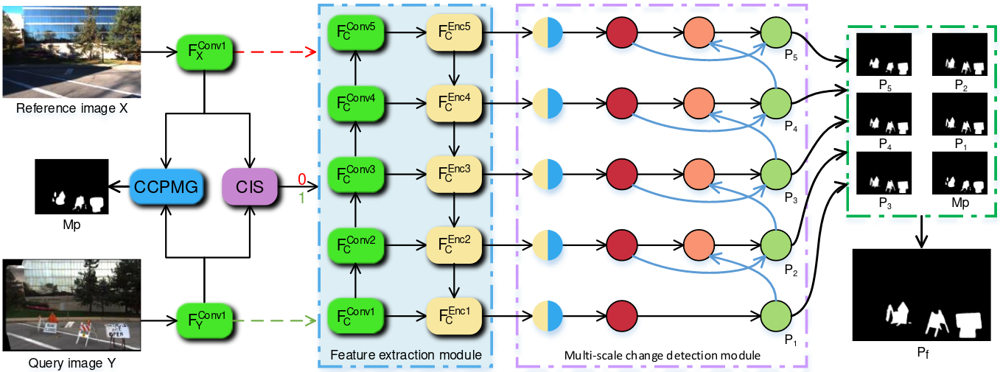

# Selecting changing image for efficient change detection
Official implement of the IET SP 2021 Paper：**Selecting changing image 
for efficient change detection**. If you find this 
work helps in your research, please consider citing.

----------------------
## Requirements
- Python 3.7
- Pytorch 1.4.0
- torchvision 0.5.0

## Installation

## Quick Start

## Train

## Evaluate
You can find the evaluation config in the folder`option`. 
You can run the script file by `python test_XX.py` 
in the command environment.
> python test_CIS.py # Evaluate the accuracy of CIS(VL-CMU-CD and CDnet dataset)

> python test_CMU.py # Evaluation on the VL-CMU-CD dataset

> python test_CDnet.py # Evaluation on the CDnet dataset

```
options 
- cuda: True/False
- cd-model: model to train or test CD
- cd-model-dir: path to stored-model
- datadir: data path
- cis-model: model to select change image
- cis-model-dir: path to stored-cis-model
```

## Dataset Preparation

### Data structure
```
Change detection data set with pixel-level binary labels:
├─image.txt
├─image2.txt
└─label.txt
```

`image.txt`: image path of t1 phase; ( /xxx/MyDataset/T1.jpg 0) -> change image;

`image2.txt`: image2 path of t2 phase; ( /xxx/MyDataset/T2.jpg 1) -> unchange image;

`label.txt`: label path; ( /xxx/MyDataset/label.png)


### Data Download 

VL-CMU-CD: [GoogleDriver](https://drive.google.com/uc?id=0B-IG2NONFdciOWY5QkQ3OUgwejQ&export=download),
[BaiDuNetDisk (uljc)](https://pan.baidu.com/s/1QVhaxHVOh5ly-5eJMAssyg)

CDnet: http://jacarini.dinf.usherbrooke.ca/dataset2014/

## License

Code is released for non-commercial and research purposes **only**. For commercial purposes, please contact the authors.

## Citation

If you use this code for your research, please cite our paper:

```
@Article{huang2021a,
    title={Selecting change image for efficient change detection},
    author={Rui Huang, Ruofei Wang, Yuxiang Zhang, Yan Xing, Wei Fan and KaiLeung Yung},
    year={2021},
    journal={IET Signal Processing},
    volume={},
    number={},
    pages={},
    doi={10.1049/sil2.12095}
}
```